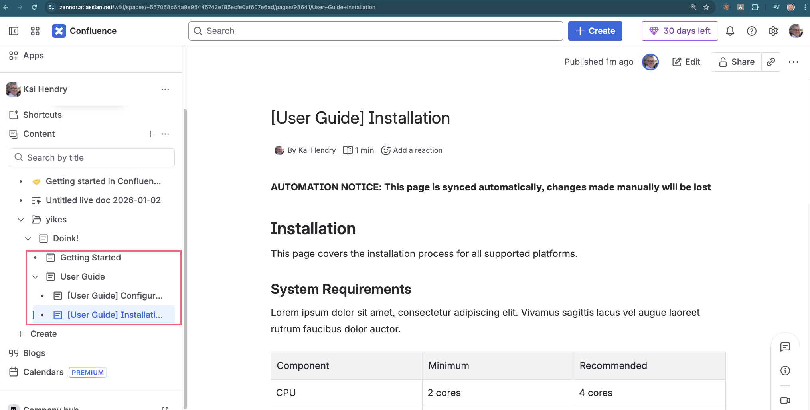

Related video: https://youtu.be/-JYi5oOVpZQ?si=HfG2_ORmXYMgsTVJ

## Learnings from markdown-confluence-sync-action

Testing [Telefonica/markdown-confluence-sync-action](https://github.com/Telefonica/markdown-confluence-sync-action) for syncing Markdown docs to Confluence.

### ✅ What Works

- **Mermaid diagrams** - Rendered as SVG images and uploaded to Confluence
  - Flowcharts, sequence diagrams, pie charts, state diagrams, Gantt charts all work
  - Emoji in diagrams render correctly
- **Markdown tables** - Converted properly
- **Local images** - PNG, JPEG, SVG files committed to the repo work
- **Inline code** - Renders with monospace font
- **Frontmatter metadata** - `title` and `sync_to_confluence` fields work as expected
- **Tree mode** - Folder hierarchy mirrors to Confluence page hierarchy

### ⚠️ Requires Configuration

- **Code blocks with syntax highlighting** - Need `rehype.codeBlocks: true` in workflow config
  - Without it: renders as plain preformatted text (no highlighting)
  - With it: uses Confluence code macro with language-specific highlighting

### ❌ What Doesn't Work

- **External image URLs** - Placeholder images from `via.placeholder.com` show "Preview unavailable"
  - Confluence likely blocks or can't fetch external URLs
  - **Workaround**: Use local images committed to the repo instead

### 💡 Tips

- Use path filters to only run when `docs/**` changes
- The action uses Docker, so expect ~1 min build time on first run