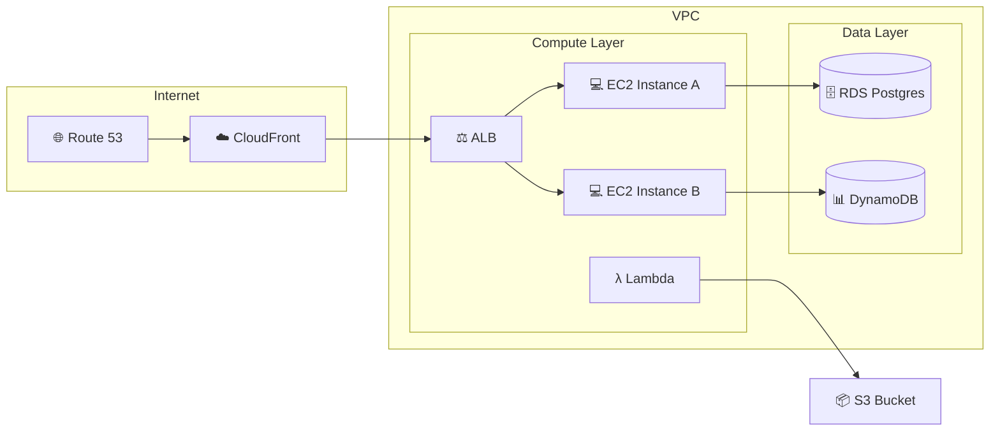
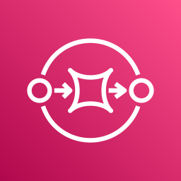
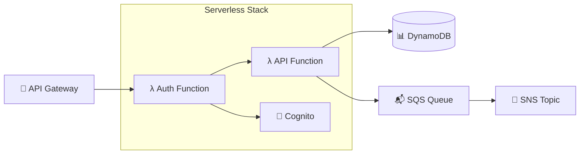
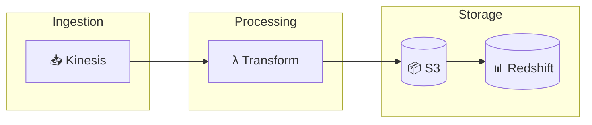

# AWS Architecture Diagram with Mermaid

This page demonstrates AWS architecture diagrams using Mermaid flowcharts.

## Example Architecture

## AWS Icons Reference

The following AWS service icons are available locally in `images/`:

| Icon | Service | File |
|------|---------|------|
|  | AWS Lambda | `aws-lambda.svg` |
|  | Amazon EC2 | `aws-ec2.svg` |
|  | Amazon RDS | `aws-rds.svg` |
|  | Amazon DynamoDB | `aws-dynamodb.svg` |
|  | Amazon S3 | `aws-s3.svg` |
|  | Amazon CloudFront | `aws-cloudfront.svg` |
|  | Amazon Route 53 | `aws-route53.svg` |
|  | Amazon VPC | `aws-vpc.svg` |
|  | Amazon API Gateway | `aws-api-gateway.svg` |
|  | Amazon Cognito | `aws-cognito.svg` |
|  | Amazon SQS | `aws-sqs.svg` |
|  | Amazon SNS | `aws-sns.svg` |

## Serverless Example

## Data Pipeline Example

- GuardDuty
- Security Hub
- EventBridge
- AppSync
- Amplify
- And many others...

For comprehensive AWS diagrams, consider using [draw.io with AWS4 library](https://app.diagrams.net/?splash=0&libs=aws4) and exporting as SVG.
