# AWS Architecture Diagram with Mermaid

This page demonstrates the AWS icons available in Mermaid architecture diagrams via [iconify](https://icon-sets.iconify.design/?query=aws).

## Example Architecture

```mermaid
architecture-beta
    group vpc(logos:aws-vpc)[VPC]
    group compute(logos:aws-ec2)[Compute Layer] in vpc
    group data(logos:aws-rds)[Data Layer] in vpc

    service alb(logos:aws-elastic-load-balancing)[ALB]
    service ec2a(logos:aws-ec2)[EC2 Instance] in compute
    service ec2b(logos:aws-ec2)[EC2 Instance] in compute
    service lambda(logos:aws-lambda)[Lambda] in compute
    service rds(logos:aws-rds)[RDS Postgres] in data
    service dynamodb(logos:aws-dynamodb)[DynamoDB] in data
    service s3(logos:aws-s3)[S3 Bucket]
    service cloudfront(logos:aws-cloudfront)[CloudFront]
    service route53(logos:aws-route-53)[Route 53]

    route53:R --> L:cloudfront
    cloudfront:R --> L:alb
    alb:R --> L:ec2a
    alb:R --> L:ec2b
    ec2a:B --> T:rds
    ec2b:B --> T:dynamodb
    lambda:B --> T:s3
```

## Available AWS Icons (logos: prefix)

Here are the AWS icons available via iconify's `logos:` prefix:

| Icon Code | Service |
|-----------|---------|
| `logos:aws` | AWS Logo |
| `logos:aws-api-gateway` | API Gateway |
| `logos:aws-aurora` | Aurora |
| `logos:aws-cloudformation` | CloudFormation |
| `logos:aws-cloudfront` | CloudFront |
| `logos:aws-cloudwatch` | CloudWatch |
| `logos:aws-codedeploy` | CodeDeploy |
| `logos:aws-cognito` | Cognito |
| `logos:aws-dynamodb` | DynamoDB |
| `logos:aws-ec2` | EC2 |
| `logos:aws-ecs` | ECS |
| `logos:aws-eks` | EKS |
| `logos:aws-elastic-cache` | ElastiCache |
| `logos:aws-elastic-load-balancing` | ELB |
| `logos:aws-elasticbeanstalk` | Elastic Beanstalk |
| `logos:aws-fargate` | Fargate |
| `logos:aws-glacier` | Glacier |
| `logos:aws-iam` | IAM |
| `logos:aws-kinesis` | Kinesis |
| `logos:aws-kms` | KMS |
| `logos:aws-lambda` | Lambda |
| `logos:aws-mq` | MQ |
| `logos:aws-opensearch` | OpenSearch |
| `logos:aws-rds` | RDS |
| `logos:aws-redshift` | Redshift |
| `logos:aws-route-53` | Route 53 |
| `logos:aws-s3` | S3 |
| `logos:aws-ses` | SES |
| `logos:aws-sns` | SNS |
| `logos:aws-sqs` | SQS |
| `logos:aws-step-functions` | Step Functions |
| `logos:aws-vpc` | VPC |

## Serverless Example

## Data Pipeline Example

## Limitations

⚠️ **Not all AWS services have icons** in the iconify `logos:` collection. Missing services include:
- Transfer Family
- GuardDuty
- Security Hub
- EventBridge
- AppSync
- Amplify
- And many others...

For comprehensive AWS diagrams, consider using [draw.io with AWS4 library](https://app.diagrams.net/?splash=0&libs=aws4) and exporting as SVG.
