# AWS Architecture Diagram with Mermaid

This page demonstrates AWS architecture diagrams using Mermaid flowcharts.

## Example Architecture

```mermaid
flowchart LR
    subgraph Internet
        Route53[🌐 Route 53]
        CloudFront[☁️ CloudFront]
    end

    subgraph VPC[VPC]
        subgraph Compute[Compute Layer]
            ALB[⚖️ ALB]
            EC2a[💻 EC2 Instance A]
            EC2b[💻 EC2 Instance B]
            Lambda[λ Lambda]
        end
        subgraph Data[Data Layer]
            RDS[(🗄️ RDS Postgres)]
            DynamoDB[(📊 DynamoDB)]
        end
    end

    S3[📦 S3 Bucket]

    Route53 --> CloudFront
    CloudFront --> ALB
    ALB --> EC2a
    ALB --> EC2b
    EC2a --> RDS
    EC2b --> DynamoDB
    Lambda --> S3
```

## AWS Icons Reference

The following AWS service icons are available locally in `images/`:

| Icon | Service | File |
|------|---------|------|
|  | AWS Lambda | `aws-lambda.svg` |
|  | Amazon EC2 | `aws-ec2.svg` |
|  | Amazon RDS | `aws-rds.svg` |
|  | Amazon DynamoDB | `aws-dynamodb.svg` |
|  | Amazon S3 | `aws-s3.svg` |
|  | Amazon CloudFront | `aws-cloudfront.svg` |
|  | Amazon Route 53 | `aws-route53.svg` |
|  | Amazon VPC | `aws-vpc.svg` |
|  | Amazon API Gateway | `aws-api-gateway.svg` |
|  | Amazon Cognito | `aws-cognito.svg` |
|  | Amazon SQS | `aws-sqs.svg` |
|  | Amazon SNS | `aws-sns.svg` |

## Serverless Example

```mermaid
flowchart LR
    subgraph Serverless[Serverless Stack]
        AuthFn[λ Auth Function]
        ApiFn[λ API Function]
        Cognito[🔐 Cognito]
    end

    APIGW[🚪 API Gateway]
    DynamoDB[(📊 DynamoDB)]
    SQS[📬 SQS Queue]
    SNS[📢 SNS Topic]

    APIGW --> AuthFn
    AuthFn --> Cognito
    AuthFn --> ApiFn
    ApiFn --> DynamoDB
    ApiFn --> SQS
    SQS --> SNS
```

## Data Pipeline Example

```mermaid
flowchart LR
    subgraph Ingest[Ingestion]
        Kinesis[📥 Kinesis]
    end

    subgraph Process[Processing]
        Lambda[λ Transform]
    end

    subgraph Store[Storage]
        S3[(📦 S3)]
        Redshift[(📊 Redshift)]
    end

    Kinesis --> Lambda
    Lambda --> S3
    S3 --> Redshift
```

- GuardDuty
- Security Hub
- EventBridge
- AppSync
- Amplify
- And many others...

For comprehensive AWS diagrams, consider using [draw.io with AWS4 library](https://app.diagrams.net/?splash=0&libs=aws4) and exporting as SVG.
