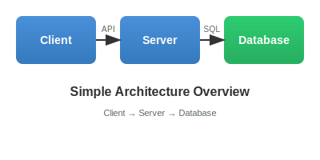
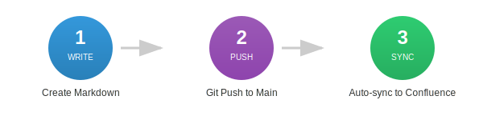
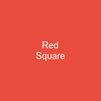

# Image Testing

This page tests various image formats and embedding methods for the markdown-confluence-sync-action.

## Local SVG Images

### Architecture Diagram

### Workflow Steps

### Logo / Branding

### Status Badge

## Image Sizing

Testing different markdown image approaches:

### Standard Markdown

### HTML img Tag (if supported)

## PNG Images

### Blue PNG Test

### Red Square PNG

## JPEG Images

### Green JPEG Test

### Gradient Banner JPEG

## Expected Results

| Image Type | Format | Expected Result |
|------------|--------|-----------------|
| Local SVG | `.svg` | ✅ Should render |
| Local PNG | `.png` | ✅ Should render |
| Local JPG | `.jpg` | ✅ Should render |
| External URL | `https://...` | ❌ Preview unavailable |

## Notes

- All images should be committed to the repository
- External URLs (e.g., placeholder.com) do not work in Confluence
- SVG files render well and are scalable
- Relative paths from the markdown file location work correctly
