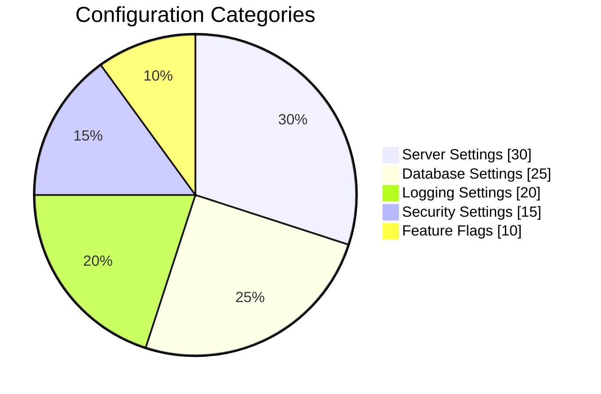
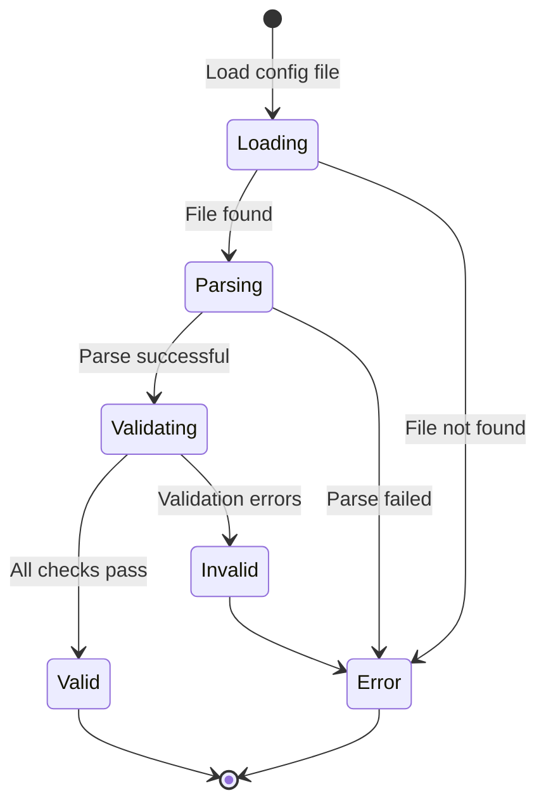

# Configuration

Learn how to configure the application for your specific needs.

## Configuration File

The main configuration file is located at `config.yaml`. Lorem ipsum dolor sit amet, consectetur adipiscing elit.



```yaml
# Example configuration
server:
  host: localhost
  port: 8080

database:
  connection_string: "postgres://localhost:5432/mydb"
  pool_size: 10

logging:
  level: info
  format: json
```

## Environment Variables

You can also configure the application using environment variables:

| Variable | Description | Default |
|----------|-------------|---------|
| `APP_HOST` | Server host address | `localhost` |
| `APP_PORT` | Server port number | `8080` |
| `APP_LOG_LEVEL` | Logging verbosity | `info` |
| `APP_DEBUG` | Enable debug mode | `false` |

## Configuration Options

### Server Settings

Praesent commodo cursus magna, vel scelerisque nisl consectetur et. Aenean lacinia bibendum nulla sed consectetur.

- **host**: The hostname or IP address to bind to
- **port**: The port number for the HTTP server
- **timeout**: Request timeout in seconds

### Database Settings

Cras mattis consectetur purus sit amet fermentum. Donec ullamcorper nulla non metus auctor fringilla.

- **connection_string**: Full database connection URL
- **pool_size**: Maximum number of connections in the pool
- **retry_attempts**: Number of reconnection attempts

### Logging Settings

Maecenas sed diam eget risus varius blandit sit amet non magna. Integer posuere erat a ante venenatis dapibus.

- **level**: `debug`, `info`, `warn`, `error`
- **format**: `text` or `json`
- **output**: File path or `stdout`

## Advanced Configuration

### Feature Flags

Vestibulum id ligula porta felis euismod semper. Cum sociis natoque penatibus et magnis dis parturient montes.

```yaml
features:
  enable_cache: true
  enable_metrics: true
  experimental_mode: false
```

### Security Settings

Nullam quis risus eget urna mollis ornare vel eu leo. Donec sed odio dui.

```yaml
security:
  tls_enabled: true
  cert_file: /path/to/cert.pem
  key_file: /path/to/key.pem
```

## Validation

To validate your configuration:



```bash
example-cli config validate
example-cli config show
```

## See Also

- [Getting Started](../getting-started.md)
- [Installation](installation.md)
