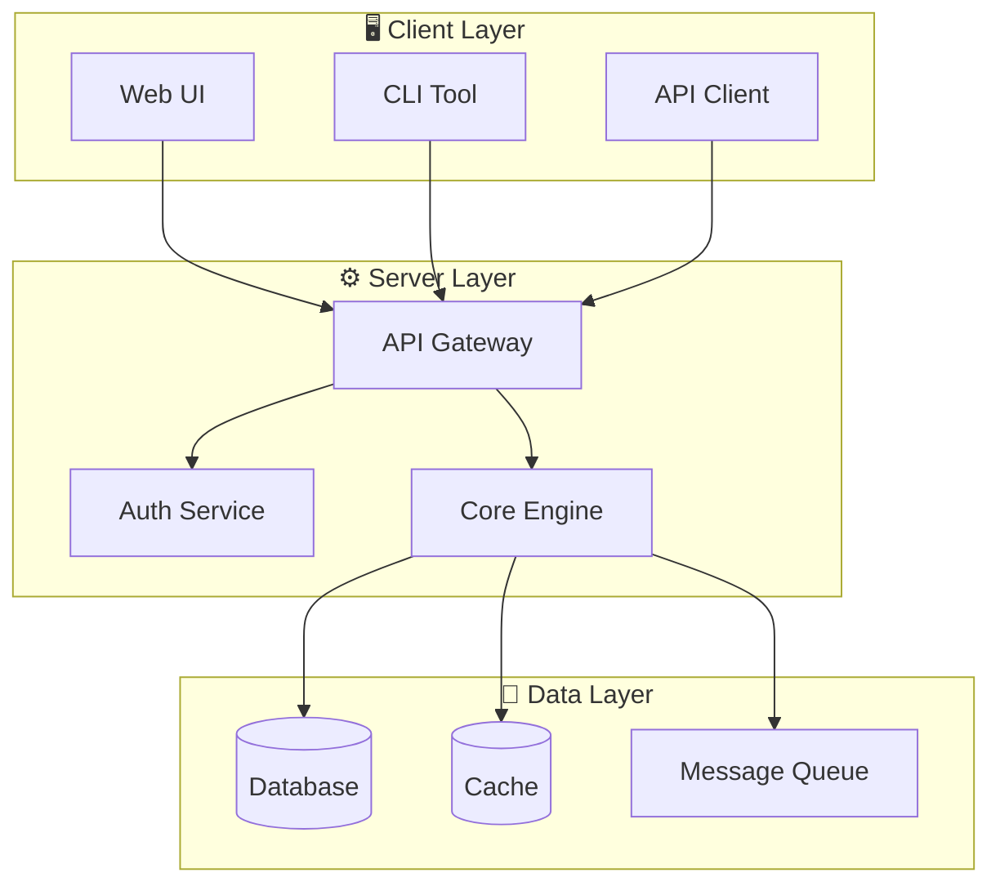

# User Guide

This comprehensive guide covers everything you need to know about using our product.

## Overview

Lorem ipsum dolor sit amet, consectetur adipiscing elit. Praesent commodo cursus magna, vel scelerisque nisl consectetur et. Nullam id dolor id nibh ultricies vehicula ut id elit.

## Sections

This guide is divided into the following sections:

1. **[Installation](installation.md)** - How to install and set up the application
2. **[Configuration](configuration.md)** - Detailed configuration options and settings

## Key Concepts

### Architecture

Cras mattis consectetur purus sit amet fermentum. Donec ullamcorper nulla non metus auctor fringilla. Aenean lacinia bibendum nulla sed consectetur.

### Components

Maecenas sed diam eget risus varius blandit sit amet non magna. Integer posuere erat a ante venenatis dapibus posuere velit aliquet. Duis mollis, est non commodo luctus.

## Support

If you need help, please refer to our support resources:

- Community forums
- Issue tracker
- Documentation updates

Vestibulum id ligula porta felis euismod semper. Cum sociis natoque penatibus et magnis dis parturient montes, nascetur ridiculus mus.
