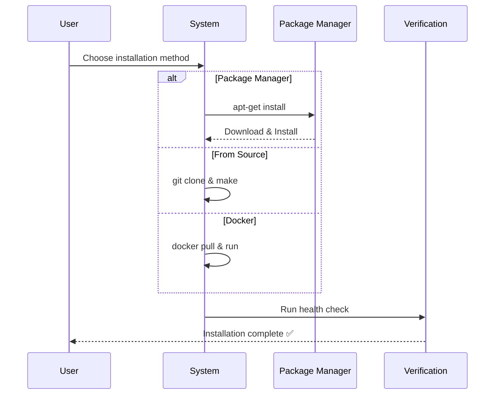
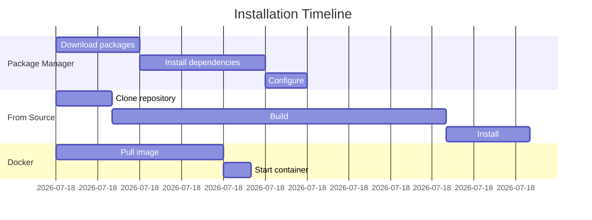

# Installation

This page covers the installation process for all supported platforms.

## System Requirements

Lorem ipsum dolor sit amet, consectetur adipiscing elit. Vivamus sagittis lacus vel augue laoreet rutrum faucibus dolor auctor.

| Component | Minimum | Recommended |
|-----------|---------|-------------|
| CPU       | 2 cores | 4 cores     |
| Memory    | 4 GB    | 8 GB        |
| Disk      | 10 GB   | 50 GB       |

## Installation Methods

The following diagram illustrates the installation workflow:




### Method 1: Package Manager

Curabitur blandit tempus porttitor. Nullam quis risus eget urna mollis ornare vel eu leo.

```bash
# Install via package manager
apt-get update
apt-get install example-package
```

### Method 2: From Source

Donec sed odio dui. Etiam porta sem malesuada magna mollis euismod.

```bash
git clone https://github.com/example/repo.git
cd repo
make install
```

### Method 3: Docker

Maecenas faucibus mollis interdum. Nullam id dolor id nibh ultricies vehicula.

```bash
docker pull example/image:latest
docker run -d example/image:latest
```

## Post-Installation

Typical installation timeline:



After installation, verify that everything is working correctly:

```bash
example-cli --version
example-cli health-check
```

## Troubleshooting

### Common Issues

**Issue 1:** Lorem ipsum dolor sit amet
- Solution: Consectetur adipiscing elit sed do eiusmod

**Issue 2:** Ut enim ad minim veniam
- Solution: Quis nostrud exercitation ullamco laboris

## Next Steps

Once installed, proceed to [Configuration](configuration.md) to set up your environment.
